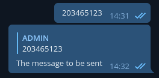

# Telegram bot

> script to push message with your bot, and reply message for your bot, by interacting with the bot

### ***To run the script***

- install python

- put your bot token in 'config.cfg' under [bot] > [token]

- put admin chat ID or user ID in 'config.cfg' under [settings] > [admin_id]

- make

- launch with telegram_bot and select

### ***How to use***

- any message sent to the bot will be forward to the admin chat ID you inserted in 'config.cfg'  
  
  the admin chat ID can be both your own user chat ID(your user ID is also your chat ID) or a group chat ID  
  
  to reply to the user, you simply reply to the forwared message  
  
  your message will be sent to the user directly

- to send a message to a chat, you first have to know the chat ID of the user or the group chat ID  
  
  then you'll have to reply to a message with the chat ID like this  
    
    
    by that you can send text message or sticker to a group chat or user

-------

# Telegram bot api message pusher

> simple script for you to push message with your bot by interacting with the terminal window

### ***To run the script***

- install python

- put your bot token in 'config.cfg' under [bot] > [token]

- make

- launch with telegram_bot and select

### ***Tips***

while the script asking you for the text and the sticker ID, you can type ***:q*** to restart script

you can choose to send typing action to chat by changing 'config.cfg' under [settings] > [send_typing], the default is set to True

you can also choose to use markdown from 'config.cfg' under [settings] > [use_markdown], the default is set to False

------------

# Telegram support bot

> script for setting up a support bot

### ***To run the script***

- install python

- put your bot token in 'config.cfg'

- put admin chat ID or user ID in 'config.cfg' under [settings] > [admin_id]

- make

- launch with telegram_bot and select

### ***How to use***

if a user send a message to the bot, it'll forward it to the chat ID you inserted in 'config.cfg'

the chat ID can be both your own user ID(your user ID is your chat ID) or a group chat ID

to reply to the user, you simply reply to the forwared message

your message will be sent to the user directly